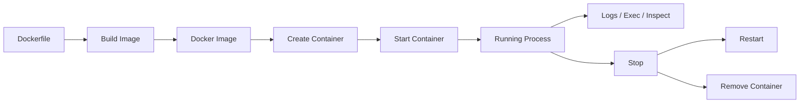

# Introduction to Docker

## What is Docker?

Docker is a containerization platform that helps us build, share, and run applications in isolated environments called **containers**. It's essential for large organizations and development teams.

---

## Why Do We Need Docker?

Traditional software development faces several challenges when working in teams.

### Example Scenario

- **Developer A has:** Node.js v16 + MongoDB v4.2 on Windows
- **Developer B needs to replicate the same environment:** on Mac

Manual setup leads to version mismatches and configuration errors.

### Common Problems

- **Manual Installation Errors** — Installing dependencies one by one
- **Version Compatibility Issues** — Different versions of the same technology
- **Environment Inconsistencies** — "It works on my machine" problem
- **Platform Dependencies** — OS-specific commands and configurations

---

## Docker's Solution

### The Classic Problem: "It Works on My Machine"

Instead of installing dependencies individually, Docker packages:

- Application Code
- All Dependencies
- Runtime Environment
- System Libraries

Into a single, portable unit called a **Container**.

---

# Docker Engine

On the installation of Docker, it installs two things:

- **Docker CLI**
- **Docker GUI**

**Docker Engine** is the main/core part of Docker. It is responsible for **creating, running, and managing containers**.

Docker Engine works using a **client-server architecture**.

It has three main parts:

1. **Docker Client (CLI)**
2. **Docker Daemon**
3. **REST API**

## Workflow

**Docker CLI** is the tool we use to communicate with Docker.

For example:

```bash
docker run nginx
```

When we run this command, the CLI sends a request to the **Docker Daemon** through the **REST API**.

The **REST API** is the communication layer between the **Docker Client** and the **Docker Daemon**. It provides a set of APIs that allow the client and other applications to interact with the Docker Daemon.

The **Docker Daemon** is the long-running background service responsible for performing the actual Docker operations.

It:

- Listens for Docker API requests
- Builds Docker images
- Creates and runs containers
- Stops and removes containers
- Manages networks and volumes

---

# Docker Core Concepts

## 1. Docker Image

A Docker Image is:

- A **read-only template/blueprint** for creating containers.
- An **executable package** containing everything needed to run an application, including instructions, dependencies, libraries, and configuration.
- A **static snapshot** of what the environment should look like.
- **Not a running application**; it is used to create containers.
- Made up of **multiple layers**.

### Example

Suppose we have a Node.js application.

The Docker Image can contain:

```text
Node.js -> Dependencies -> Application Code -> Configuration
```

## 2. Docker Container

A **Docker Container** is a **running instance of a Docker Image**.

A container can contain:

- Your application
- Dependencies
- Runtime environment
- Startup commands

A container can be:

- Created
- Started
- Stopped
- Removed
- Connected to a network
- Connected to storage

### Key Properties

- **Portable** — Can be shared and run across different systems.
- **Lightweight** — Has minimal overhead compared to virtual machines.
- **Isolated** — Each container runs in an isolated environment.

### Example

```text
Container 1
App A + Node.js v16 + Dependencies

Container 2
App B + Node.js v20 + Dependencies
```

Both applications can use different Node.js versions without interfering with each other.

### Relationship: Image vs Container

The easiest way to remember the difference:

```text
Docker Image : Docker Container
      ↓               ↓
    Class     :     Object
  Blueprint   :    Instance
```

For example:

```text
Node.js App Image -> Create Container -> Running Node.js App
```

| Docker Image              | Docker Container                         |
| ------------------------- | ---------------------------------------- |
| Blueprint                 | Running instance                         |
| Read-only                 | Can be modified while running            |
| Used to create containers | Created from an image                    |
| Static                    | Running/dynamic                          |
| Can be shared             | Runs on a specific system                |
| Made of layers            | Uses the image layers + a writable layer |
| Like a class in OOP       | Like an object in OOP                    |

Add the following section at the bottom of your note:

## 3. Docker Volume

A **Docker Volume** is used to **store data** outside the container.

- Data remains safe even if the container is removed.
- Useful for databases and persistent application data.

### Example

```text
Container → Docker Volume → Data
```

## 4. Docker Network

A **Docker Network** allows **containers to communicate with each other and with other services**.

- Containers can connect to the same network.
- Containers can communicate using their container names.

### Example

```text
Backend Container ←→ Database Container
          ↓
     Docker Network
```

## 5. Docker Registry

A **Docker Registry** is a place where **Docker Images are stored and shared**.

- We can **push** images to a registry.
- We can **pull** images from a registry.

There can be many different registries.

Examples:

- Docker Hub
- GitHub Container Registry (GHCR)
- Amazon ECR

### What is Docker Hub?

**Docker Hub** is a **public Docker Registry provided by Docker**.

- Public collection of Docker images
- Official images for popular technologies
- Community-contributed images

### Accessing Docker Hub

- URL: `hub.docker.com`
- Search for images (e.g., `ubuntu`, `node`, `mongodb`)
- View documentation and usage examples

---

## Docker Lifecycle



A Docker image can be created from a Dockerfile or downloaded from Docker Hub, and it serves as a blueprint to create a Docker container (like an instance or object), which represents the running application in a live environment.

---

# Basic Docker Commands

## 1.

```bash
docker run hello-world
```

**Downloads the image** if it is not available locally and **creates a container** from it.

---

## 2. Pull an Image

```bash
docker pull nginx
```

Downloads the **image** from the configured Docker Registry.

---

## 3.

```bash
docker run -d --name my-nginx -p 8080:80 nginx
```

create container from the image and run it in the background

### Breakdown

```text
-d
↓
Run container in detached/background mode

--name my-nginx
↓
Give the container the name "my-nginx"

-p 8080:80
↓
Map host port 8080 → container port 80

nginx
↓
Docker image to use
```

You can then access Nginx at:

```text
http://localhost:8080
```

---

## 4. View Container Logs

```bash
docker logs my-nginx
```

Displays the logs generated by the container.

---

## 5. List Running Containers

```bash
docker ps
```

Shows currently running containers.

To show **all containers**, including stopped containers:

```bash
docker ps -a
```

---

## 6. Start a Stopped Container

```bash
docker start my-nginx
```

Starts an existing stopped container.

---

## 7. Stop a Container

```bash
docker stop my-nginx
```

Stops the running container.

---

## 8. Remove a Container

```bash
docker rm my-nginx
```

Removes the container.

**Important:** A running container cannot normally be removed with `docker rm`. Stop it first:

```bash
docker stop my-nginx
docker rm my-nginx
```

Alternatively, force removal:

```bash
docker rm -f my-nginx
```

---

#############################

#############################

# Essential Docker Commands

## 1. Docker Pull Command

Downloads an image from Docker Hub to the local system.

### Download Specific Image

```bash
docker pull hello-world
docker pull ubuntu
docker pull nginx
```

### Pull Specific Version/Tag

```bash
docker pull ubuntu:20.04
docker pull node:16
```

---

## 2. Docker Images Command

Lists all locally available images.

### List All Images

```bash
docker images
```

### Output Example

```text
REPOSITORY    TAG       IMAGE ID       CREATED        SIZE
hello-world   latest    feb5d9fea6a5   2 years ago    13.3kB
ubuntu        latest    ba6acccedd29   2 months ago   72.8MB
```

---

## 3. Docker Run Command

Creates and runs a new container from an image.

### Basic Syntax

```bash
docker run <image-name>
```

### Examples

```bash
docker run hello-world
docker run ubuntu
docker run nginx
```

> **Important:** `docker run` always creates a **NEW** container, even if one already exists.

---

# Working with Images

## Image Properties

- **Repository** — Image name (e.g., `ubuntu`, `hello-world`)
- **Tag** — Version identifier (e.g., `latest`, `v16`, `20.04`)
- **Image ID** — Unique identifier
- **Size** — Storage space used

---

## Example: Hello World Image

```bash
# Pull the image
docker pull hello-world

# Run container from image
docker run hello-world

# Output explains Docker workflow:
# 1. Docker client contacted Docker daemon
# 2. Docker daemon pulled image from Docker Hub
# 3. Docker daemon created new container
# 4. Container executed and produced output
```

---

# Working with Containers

## Container Lifecycle

```text
Image → docker run → Container (Running) → Exit → Container (Stopped)
```

## Container States

- **Running** — Currently executing
- **Stopped/Exited** — Finished execution
- **Paused** — Temporarily suspended

---

## Viewing Containers

### View Running Containers Only

```bash
docker ps
```

### View All Containers (Running + Stopped)

```bash
docker ps -a
```

### Example Output

```text
CONTAINER ID   IMAGE         COMMAND       CREATED         STATUS                     NAMES
abc123def456   ubuntu        "/bin/bash"   2 minutes ago   Exited (0) 1 minute ago    mystifying_tesla
789ghi012jkl   hello-world   "/hello"      5 minutes ago   Exited (0) 5 minutes ago   wonderful_darwin
```

---

# Interactive Mode

Docker's interactive mode allows direct interaction with a running container's shell, enabling real-time command execution and interaction with its file system.

This mode is particularly useful for debugging, development, and troubleshooting within a container.

## Running Containers Interactively

Use the `-it` flag for interactive terminal access:

```bash
# Run Ubuntu container in interactive mode
docker run -it ubuntu
```

### Breakdown

```text
-i : Interactive mode (keep STDIN open)
-t : Allocate pseudo-TTY (terminal)
```

---

## Inside Container Environment

```bash
# You're now inside Ubuntu container
root@abc123def456:/#

# Container has its own file system
ls                    # List files in container
mkdir test-folder     # Create directory
cd test-folder        # Navigate directories
printenv              # View environment variables

# Exit container
exit
```

### Key Points

- Container has isolated file system
- Changes inside container don't affect host
- Container stops when you exit interactive mode
- Each container gets unique ID and random name

---

# Detached Mode and Attached Mode

Docker containers can run in two primary modes:

- **Attached mode** (also known as foreground mode)
- **Detached mode** (also known as background mode)

---

## Attached Mode

In attached mode, the container's standard input, output, and error streams are directly connected to your terminal. You see the container's output in real-time in your terminal window.

This mode is suitable for interactive tasks, debugging, or applications that require direct user interaction or need to be stopped when the terminal is closed.

By default, `docker run` starts a container in attached mode unless specified otherwise.

### Example

```bash
docker run nginx
```

---

## Detached Mode

In detached mode, the container runs in the background, independent of your terminal session.

You do not see the container's output directly in your terminal, and your terminal remains free for other commands.

This mode is ideal for services or applications that need to run continuously without requiring immediate attention or user interaction.

You typically use the `-d` or `--detach` flag with `docker run` to start a container in detached mode.

### Example

```bash
docker run -d nginx
```

This command starts an Nginx web server in a container in the background. You will receive the container ID as confirmation, and your terminal will be available for other tasks.

---

## Attaching to and Detaching from a Detached Container

You can later attach to a running detached container to view its logs or interact with it using the `docker attach` command.

### Example

```bash
docker attach <container_id_or_name>
```

To detach from a container without stopping it, you typically use the key sequence:

```text
Ctrl+P followed by Ctrl+Q
```

---

# Difference Between Virtual Machines and Docker Containers

VMs are heavy, fully isolated machines with their own OS; Docker containers are lightweight, share the host OS kernel, and run applications faster with minimal resources.

---

# What Is an Operating System (OS) Kernel?

The Operating System (OS) Kernel is the core part of any operating system. It acts as a bridge between hardware and software.

It decides who (which process) gets to use what (CPU, memory, files, etc.) and when.

### Where It Sits in the System

```text
Your Applications
(e.g., Chrome, VSCode)
        ↓
OS Kernel
(Manages resources)
        ↓
Hardware
(CPU, RAM, Disk)
```

---

# What Actually Happens When You Pull a Docker Image?

When you pull an image like Ubuntu or Windows Server, you are not downloading the full operating system.

You are downloading only:

> Docker image = lightweight environment, not a full OS.

It's like:

> "A fake mini Ubuntu that looks and behaves like Ubuntu inside, but borrows the kernel from your host machine."

---

## How It Actually Runs

When you run a container, it uses:

So inside the container, you'll see:

```bash
$ cat /etc/os-release
Ubuntu 22.04
```

…but it's not actually Ubuntu OS — it's your host's Linux kernel + Ubuntu's userland.

---

# In Case of macOS

## The Logic in Simple Terms

### 1. Why Docker Desktop Needs a VM on macOS

### 2. How Docker Desktop Actually Does It

When you start Docker Desktop:

---

# Container Management

## Starting Existing Containers

### Start Stopped Container by Name

```bash
docker start <container-name>
```

### Start Stopped Container by ID

```bash
docker start <container-id>
```

### Example

```bash
docker start mystifying_tesla
docker start abc123def456
```

---

## Stopping Running Containers

### Stop Running Container by Name

```bash
docker stop <container-name>
```

### Stop Running Container by ID

```bash
docker stop <container-id>
```

### Example

```bash
docker stop mystifying_tesla
docker stop abc123def456
```

---

## Key Differences

| Command        | Purpose                          | Creates New Container? |
| -------------- | -------------------------------- | ---------------------- |
| `docker run`   | Create and start new container   | ✅ Yes                 |
| `docker start` | Start existing stopped container | ❌ No                  |
| `docker stop`  | Stop running container           | ❌ No                  |

---

# Container Management Workflow

```bash
# 1. Create and run new container
docker run -it ubuntu

# Container starts, you work inside, then exit

# 2. Container is now stopped, but exists
docker ps -a

# Shows stopped container

# 3. Restart the same container
docker start <container-name>

# 4. Stop when done
docker stop <container-name>
```

---

# Practical Examples

## Example 1: Hello World Container

```bash
# Pull image
docker pull hello-world

# Run container
docker run hello-world

# Check images
docker images

# Check containers
docker ps -a
```

---

## Example 2: Ubuntu Interactive Container

```bash
# Run Ubuntu in interactive mode
docker run -it ubuntu

# Inside container:
root@container:/# ls
root@container:/# mkdir my-app
root@container:/# echo "Hello Docker" > test.txt
root@container:/# cat test.txt
root@container:/# exit

# Back to host system
# Container is now stopped
docker ps -a
```

---

## Example 3: Container Lifecycle Management

```bash
# Start stopped container
docker ps -a  # Find container name
docker start tender_newton

# Check running containers
docker ps

# Stop the container
docker stop tender_newton

# Verify it's stopped
docker ps
```

---

# Docker Desktop Usage

## Containers Tab

- View all containers (running/stopped)
- See container status, names, IDs
- Start/stop containers with GUI
- Access container logs and stats

---

## Images Tab

- View all downloaded images
- See image sizes, tags, IDs
- Green dot indicates image is being used by containers
- Delete unused images

---

## Container Details

Click a container to see detailed information:

- View logs
- View environment variables
- Access file system (in some cases)
- Monitor resource usage

---

# Best Practices

## 1. Image Management

```bash
# Always check available images
docker images

# Remove unused images to save space
docker rmi <image-name>

# Pull specific versions when needed
docker pull ubuntu:20.04
```

---

## 2. Container Naming

Assign custom names to containers:

```bash
docker run --name my-ubuntu -it ubuntu
docker run --name my-app-container -it node:16
```

---

## 3. Resource Cleanup

### Remove Stopped Containers

```bash
docker rm <container-name>
```

### Remove All Stopped Containers

```bash
docker container prune
```

### Remove Unused Images

```bash
docker image prune
```

---

# What's Next?

This transcript covered the fundamental concepts of Docker. Future topics will include:

- Dockerization of custom applications
- Dockerfile creation and best practices
- Port mapping and networking
- Environment variables
- Volume mounting
- Docker Compose for multi-container applications
- Docker networking concepts
- Container troubleshooting

---

# Summary

Docker solves the **"It works on my machine"** problem by:

- Packaging applications with their dependencies
- Standardizing deployment across environments
- Isolating applications in lightweight containers
- Simplifying team collaboration and deployment

## Key Components

| Component             | Description           |
| --------------------- | --------------------- |
| **Docker Images**     | Blueprints/Templates  |
| **Docker Containers** | Running Instances     |
| **Docker Hub**        | Public Image Registry |
| **Docker Desktop**    | GUI Management Tool   |

## Essential Commands

```bash
docker pull <image>     # Download image
docker images           # List images
docker run <image>      # Create and run container
docker ps               # List running containers
docker ps -a            # List all containers
docker start <name>     # Start stopped container
docker stop <name>      # Stop running container
```
