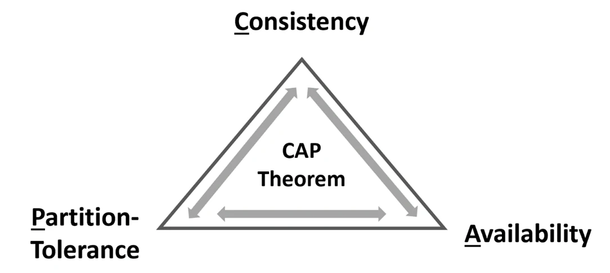

# DNS and Backend Scaling

## 1. What Is DNS and Why Is It Needed?

- Humans use **domain names** such as `google.com`.
- Computers communicate using **IP addresses** such as `52.10.20.30`.
- **DNS maps domain names to IP addresses.**
- DNS can be thought of as a **distributed database for internet names**.

---

## 2. Why Is DNS a Distributed System?

A single DNS server would create:

- **Huge database**
- **Huge traffic**
- **Single point of failure**
- Difficulty with **global updates**
- **Ownership** problems

### How Does DNS Resolution Work?

When resolving:

```text
amazon.in → ?
```

The general flow is:

```text
Browser / OS
      ↓
Recursive DNS Resolver (The main server that finds the DNS information for you.
It is usually provided by your ISP or another DNS provider. It receives the request
and keeps querying other DNS servers until it finds the required information.)
      ↓
Root Server (The top level of the DNS system. It does not know the website's IP address.
Instead, it tells the Resolver which TLD server to ask based on the domain extension,
such as .in.)
      ↓
TLD (.com, .in, .org) (The Top-Level Domain/TLD server manages a specific domain extension.
For example, a .in TLD server handles .in domains. It tells the Resolver which
Authoritative DNS Server has the information for the requested domain.)
      ↓
Authoritative DNS (The server that contains the actual DNS records for the domain
and sends the required DNS information, such as the IP address, back to the Resolver.)
      ↓
IP Address
```

---

## 3. What Is the Difference Between a Domain Registrar and a DNS Provider?

These have different responsibilities.

### What Is a Domain Registrar?

A **Domain Registrar** is the company through which you registe/buy a domain name.

Examples:

```text
GoDaddy
Namecheap
```

### What Is a DNS Provider?

A **DNS Provider** manages the DNS records that tell the internet where your domain should point.

Example:

```text
Cloudflare → DNS Provider
```

The **Registrar and DNS Provider can be the same company or different companies**.

---

## 4. What Are DNS Records and What Are the Common DNS Record Types?

DNS records are instructions stored in DNS that describe how a domain or hostname should be handled.

For example:

```text
google.com
      ↓
DNS looks at its records
      ↓
Finds where google.com should point
      ↓
Your browser connects to that server
```

| Record    | Purpose                                      |
| --------- | -------------------------------------------- |
| **A**     | Hostname → IPv4 address                      |
| **AAAA**  | Hostname → IPv6 address                      |
| **CNAME** | Hostname → another hostname                  |
| **NS**    | Domain → authoritative nameserver            |
| **MX**    | Domain → mail server                         |
| **TXT**   | Text, policies, and verification information |
| **SOA**   | Administrative metadata about the DNS zone   |

### A Record

Maps a hostname to an **IPv4 address**.

```text
example.com → 142.250.183.14
```

### AAAA Record

Maps a hostname to an **IPv6 address**.

```text
example.com → 2001:4860:4860::8888
```

### CNAME Record

Maps a hostname to **another hostname**.

```text
www.example.com → example.com
```

Here, `www.example.com` is an **alias** for `example.com`.

### NS Record

**NS** stands for **Name Server**.

An NS record specifies which DNS servers are **authoritative for a domain**.

```text
rohitji.com
     ↓
NS Records
     ↓
ns1.cloudflare.com
ns2.cloudflare.com
```

### MX Record

**MX** stands for **Mail Exchange**.

It specifies which mail servers should receive emails for a domain.

```text
example.com → mail.example.com
```

### TXT Record

Stores **text-based information** associated with a domain.

### SOA Record

**SOA** stands for **Start of Authority**.

It contains important **administrative and authoritative information** about a DNS zone.

---

## 5. Can One Hostname Have Multiple IP Addresses?

A single hostname can have multiple A records:

```text
amazon.in
   ↓
99.86.30.62
99.86.30.106
99.86.30.96
99.86.30.121
```

Possible uses:

- **Load balancing**
- **CDNs**
- **Redundancy**
- **Geographic distribution**

Also, multiple domains can share the same IP address.

---

## 6. What Is a Glue Record and Why Is It Needed?

A **glue record** helps solve a DNS loop.

For example:

```text
amazon.com
    ↓
ns1.amazon.com
```

Here, `amazon.com` uses `ns1.amazon.com` as its DNS server.

But to find `ns1.amazon.com`, we need its IP address.
And normally, we would ask `amazon.com`'s DNS server for that IP.

This creates a **loop**:

```text
Find DNS server for amazon.com
        ↓
ns1.amazon.com
        ↓
Find IP of ns1.amazon.com
        ↓
Need amazon.com's DNS server
        ↓
LOOP
```

### How Glue Record Solves It

The parent DNS zone (`.com`) provides the IP address directly:

```text
ns1.amazon.com → 20.30.40.50
```

This information is called a **glue record**.

---

## 7. What Is DNS Caching and What Is TTL?

DNS responses are **cached** by resolvers.

Example:

```text
amazon.com → 52.10.20.30
TTL = 3600 seconds
```

The resolver can cache the answer for roughly **1 hour**.

Instead of performing the complete lookup for every user:

```text
User 1 → Full lookup
User 2 → Cache
User 3 → Cache
...
```

**Caching is a major reason DNS can scale.**

---

## 8. Is CORS Related to DNS?

**CORS** applies when browser JavaScript from one origin calls another origin:

```text
https://shop.example.com
       ↓ fetch()
https://api.example.com
```

CORS occurs **after DNS and TLS**.

It does **not** control DNS mapping.

---

## 9. How Can You Check DNS Information Using Command-Line Tools?

DNS commands are used to check how a domain name is connected to a server and to see information about that domain.

### Normal Lookup

```bash
nslookup amazon.in
```

Shows the IP address of `amazon.in`.

### Use Google DNS

```bash
nslookup amazon.in 8.8.8.8
```

Checks `amazon.in` using Google's DNS server (`8.8.8.8`).

### Detailed Lookup

```bash
dig amazon.in
```

Shows detailed DNS information about `amazon.in`.

### Only A-Record IPs

```bash
dig amazon.in A +short
```

Shows only the IPv4 address of the domain.

- `A` → Return IPv4 records
- `+short` → Show only the result

### Find the Nameservers

```bash
dig amazon.in NS
```

### See the DNS Resolution Process

```bash
dig +trace amazon.in
```

Shows how DNS finds the information for a domain step by step.

```text
Root DNS Server
↓
.in DNS Server
↓
amazon.in Nameserver
↓
IP Address
```

---

# Backend Scaling

## 10. Why Is Backend Scaling Needed?

A basic architecture is:

```text
Users
  ↓
Backend Server
  ↓
Database
```

As users and requests increase, one backend server may become insufficient.

There are two main scaling approaches.

### Vertical Scaling

Increase the resources of the existing machine.

```text
4 CPU, 8 GB RAM
       ↓
16 CPU, 32 GB RAM
```

### Horizontal Scaling

Create multiple backend server instances.

```text
        Server 1
       /
Users ─ Server 2
       \
        Server 3
```

Each server can run the same Node.js/Express application.

### Difference Between Vertical and Horizontal Scaling

**Vertical scaling** increases the resources of one server.

**Horizontal scaling** adds more servers to handle the workload.

---

## 11. What Problem Occurs When We Have Multiple Backend Servers?

Suppose:

```text
Server 1 → 10.0.0.1
Server 2 → 10.0.0.2
Server 3 → 10.0.0.3
```

The system now needs to decide:

> **Which server should receive each request?**

This is the role of a **Load Balancer**.

---

## 12. What Is a Load Balancer and Why Is It Needed?

A **Load Balancer** sits between clients and backend servers.

```text
                    Server 1
                  /
User → Load Balancer → Server 2
                  \
                    Server 3
```

### How Does a Load Balancer Work?

Basic responsibility:

```text
Receive request
      ↓
Choose backend
      ↓
Forward request
      ↓
Receive response
      ↓
Return response
```

The client does not need to know which backend handled the request.

---

## 13. What Are the Common Load Balancing Algorithms?

### Round Robin

Distributes requests sequentially:

```text
Request 1 → Server 1
Request 2 → Server 2
Request 3 → Server 3
Request 4 → Server 1
Request 5 → Server 2
```

Simple and useful when servers have similar capacity.

### Least Connections

Send the request to the server with the fewest active connections.

```text
Server 1 → 50 connections
Server 2 → 10 connections
Server 3 → 30 connections

New Request → Server 2
```

### Weighted Load Balancing

Give stronger servers more traffic.

```text
Server 1 → 16 CPU → More traffic
Server 2 → 4 CPU  → Less traffic
```

### IP Hash

Uses the client's IP to select a server.

This can cause the same client to repeatedly reach the same backend.

---

## 14. What Are Health Checks and Why Does a Load Balancer Need Them?

A load balancer should avoid sending requests to unhealthy servers.

```text
Server 1 ✅
Server 2 ❌
Server 3 ✅
```

### How Does a Load Balancer Detect an Unhealthy Server?

Servers can expose an endpoint such as:

```text
GET /health
```

The load balancer periodically checks it.

If a server becomes unhealthy:

```text
Do not send new requests to it.
```

---

## 15. Why Should Backend Servers Be Stateless?

When there are multiple servers, the load balancer can send each request to a **different server**:

```text
Request 1 → Server 1
Request 2 → Server 3
Request 3 → Server 2
```

So, you **cannot depend on one server's RAM** to remember important user information.

### Bad Approach

Suppose Server 1 stores:

```text
Server 1 RAM:
currentUser = Soumadip
```

If the next request goes to Server 3:

```text
Request → Server 3
```

Server 3 doesn't know about `currentUser` because that information was only in Server 1's RAM.

### Better Approach

Store important/shared data somewhere that **all servers can access**.

---

## 16. Why Is JWT Useful When Using Multiple Backend Servers?

**JWT** is useful when you have multiple servers because each server can verify the JWT independently.

```text
User
 ↓
JWT
 ↓
Load Balancer
 ↓
Any Server
 ↓
Verify JWT
```

For example:

```text
First request  → Server 1
Second request → Server 3
Third request  → Server 2
```

All three servers can verify the user's JWT if they have the required secret/key.

So the user **doesn't need to stay connected to Server 1**.

---

## 17. What Are Sticky Sessions or Session Affinity?

**Sticky Session** means the load balancer tries to send the same user's requests to the **same server**.

```text
User A → Server 2
User A → Server 2
User A → Server 2
```

The load balancer remembers or identifies which backend server a user is associated with and sends subsequent requests from that user to the same server.

However, stateless architecture is generally more flexible.

Because if one server crashes and suppose user 2 is stored in that server only, then the session/data stored in its RAM can be lost.

---

## 18. What Is DNS Round Robin and How Does It Work?

**DNS Round Robin** is a simple technique where one domain name is associated with **multiple IP addresses**.

For example:

```text
api.example.com → 10.0.0.1
api.example.com → 10.0.0.2
api.example.com → 10.0.0.3
```

When a client asks DNS for `api.example.com`, DNS can return these IP addresses.

A simple architecture looks like:

```text
                 DNS
                  ↓
          ┌───────┼───────┐
          ↓       ↓       ↓
         LB1     LB2     LB3
          ↓       ↓       ↓
           Backend Servers
```

**Important:**

DNS does not forward HTTP requests. DNS only provides the IP addresses. The browser/OS then establishes the connection.

---

## 19. What Are the Limitations of DNS-Based Failover?

DNS can provide multiple IP addresses:

```text
10.0.0.1
10.0.0.2
10.0.0.3
```

If one server is unavailable, the client **may** try another IP address.

However, DNS is **not a perfect failover mechanism**.

### Why?

Because DNS responses can be **cached** by clients, operating systems, browsers, and DNS resolvers.

The caching duration is controlled by **TTL (Time To Live)**.

For example:

```text
DNS → 10.0.0.1
TTL → 300 seconds
```

This means the answer can be cached for up to **5 minutes**.

If `10.0.0.1` goes down during that time, some clients may still have the old IP cached and continue trying to use it.

---

## 20. What Is Anycast and How Does It Work?

**Anycast is a networking technique where multiple servers in different locations use the same IP address.**

For example, normally you might have:

```text
India  → IP1
Europe → IP2
USA    → IP3
```

With **Anycast**, all these locations can use the **same IP**:

```text
              20.30.40.50
                    ↓
          ┌─────────┼─────────┐
          ↓         ↓         ↓
        India     Europe      USA
```

When a user connects to `20.30.40.50`, the **Internet's routing system decides which location is the best one to reach**.

**Anycast** is useful for large global systems but is not necessary for a basic backend architecture.

---

# Consistent Hashing

## 21. What Is Sharding?

**Sharding** means splitting a large amount of data across multiple databases or servers.

Suppose we have **3 million users** and 3 database shards:

```text
DB0
DB1
DB2
```

Instead of storing all 3 million users in one database, we distribute them:

```text
3 Million Users
       ↓
 ┌─────┼─────┐
 ↓     ↓     ↓
DB0   DB1   DB2
```

The main problem is:

> **How do we decide which database should store a particular user?**

---

## 22. Why Do We Need Hashing for Sharding?

A simple solution is:

```text
hash(userId) % numberOfDatabases
```

For example:

```text
hash(Rohit) = 10

10 % 3 = 1

Rohit → DB1
```

Hashing gives us two useful properties:

- The **same key gives the same result**.
- A good hash function spreads keys approximately **uniformly**.

Ideally:

```text
DB0 → ~1M users
DB1 → ~1M users
DB2 → ~1M users
```

---

## 23. What Is the Problem With `hash(key) % numberOfDatabases`?

Suppose we start with 3 databases:

```text
hash(userId) % 3
```

Later, we add another database:

```text
DB0
DB1
DB2
DB3
```

Now we need:

```text
hash(userId) % 4
```

Consider:

```text
hash(Rohit) = 10
```

Before:

```text
10 % 3 = 1

Rohit → DB1
```

After adding DB3:

```text
10 % 4 = 2

Rohit → DB2
```

The same user is now mapped to a different database.

For a large number of keys, this causes **massive data remapping and migration**.

For example:

```text
3M users

~750K stay
~2.25M move
```

The problem is:

> **Changing the number of databases changes the hashing rule, causing many keys to move.**

---

## 24. What Is Consistent Hashing?

**Consistent hashing** is a technique for distributing keys across multiple servers or databases while minimizing the amount of data that needs to move when nodes are added or removed.

Instead of:

```text
hash(key) % numberOfNodes
```

consistent hashing uses:

```text
Key
 ↓
Hash
 ↓
Position in a fixed hash space
 ↓
Find responsible node
```

The important idea is:

> **The hash space stays fixed even when the number of servers changes.**

### How Does Consistent Hashing Solve the Remapping Problem?

Imagine a fixed hash space:

```text
0 ---------------------------- 99
```

A key is hashed into this space.

For example:

```text
hash(Rohit) = 37
```

The key gets a position:

```text
Rohit → 37
```

The database nodes also have positions in the same hash space.

```text
0 ---- DB0 ---- DB1 -------- DB2 ---- 99
```

When a new database joins, we add its position to the existing hash space.

Only the **nearby range** needs to change ownership.

The fixed hash space can be visualized as a **circle** instead of a straight line.

For example:

```text
              25
          ┌─────────┐
       10 │         │ 40
          │         │
       95 │         │ 55
          └─────────┘
              75
```

Because the end connects back to the beginning, it forms a **ring**.

This is called a **hash ring**.

> The ring is mainly a conceptual visualization. In actual code, we usually store the positions in an ordered data structure.

### How Does a Key Find Its Database?

Suppose:

```text
hash(userId) = 37
```

And the database positions are:

```text
20
38
55
80
```

We move **clockwise** from `37` and find the first database position:

```text
37 → 38
```

Therefore:

```text
User → Database at position 38
```

This database is called the **successor** of the key.

### What Happens When a New Database Is Added?

Suppose:

```text
36 ----------- 45
              DB2
```

The range belongs to DB2.

Now a new database, DB4, joins at position `40`:

```text
36 ----- 40 ----- 45
       DB4        DB2
```

Ownership becomes:

```text
37 - 40 → DB4
41 - 45 → DB2
```

Only the nearby range needs to be migrated.

The rest of the data remains where it is.

This is the core benefit:

> **Adding a node changes ownership only for nearby ranges instead of reshuffling almost the entire cluster.**

---

# CAP Theorem

## 25. What Is CAP Theorem?

We know about **ACID** properties: **Atomicity, Consistency, Isolation, and Durability**. ACID primarily describes transaction guarantees within a database system. In a distributed system, we also need to consider **CAP theorem**, which describes the trade-off between consistency, availability, and partition tolerance when network partitions occur.

CAP theorem consists of three properties:

1. **Consistency (C):** Every read receives the **most recent successful write** or an error. In other words, all nodes appear to have the same latest data.

2. **Availability (A):** Every request receives a **non-error response**, even if some nodes are unavailable. The response may not contain the latest data.

3. **Partition Tolerance (P):** The system continues to operate despite a **network partition** between nodes. For example, if communication between Server A and Server B is lost, the system must still handle requests according to its design.



### CAP Theorem Trade-off

The important point is that the trade-off occurs **when a network partition happens**.

> **During a network partition, a distributed system cannot guarantee both Consistency and Availability (`CA`) at the same time. It must choose between them while maintaining Partition Tolerance.**

Therefore:

```text
          Network Partition
                 ↓
        ┌────────┴────────┐
        ↓                 ↓
       CP                 AP
Consistency + P     Availability + P
        ↓                 ↓
 May reject/wait      Continue serving
```

- **CP (Consistency + Partition Tolerance):** During a network partition, the system prioritizes **consistent/latest data** and may reject or delay some requests rather than return potentially stale data.

  **Example:** Banking or financial transactions often prioritize consistency because incorrect or stale data can be more harmful than temporary unavailability.

- **AP (Availability + Partition Tolerance):** During a network partition, the system prioritizes **availability** and continues responding to requests, even if some responses may contain stale data. The system can reconcile data later depending on its design.

  **Example:** Some social-media features or large-scale shopping features may prioritize availability and tolerate eventual consistency.

### Important Note About CA

CA (Consistency + Availability) can be achieved when there is no network partition.

However, in a distributed system, when a network partition occurs, the system cannot guarantee both C and A simultaneously.

---
