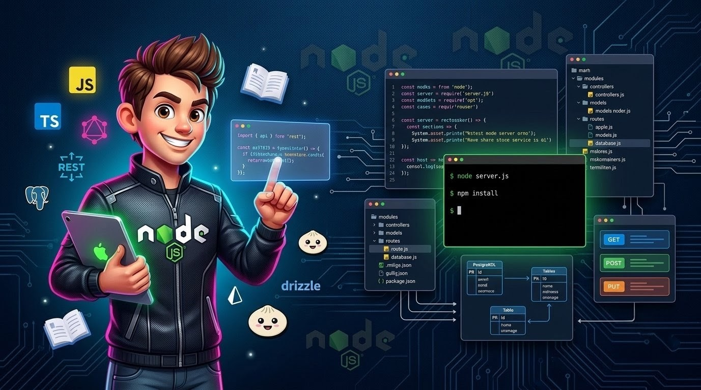

<h1 align="center">
  NODEJS-Playground 📗
</h1>

<p align="center">
A personal playground to document and practice my Node.js learning journey — from fundamentals to advanced core concepts. 🌱  
</p>

<div align="center">
  
</div>

---

## 🔋 Contents

This repository covers a wide range of Node.js topics with notes, examples, and hands-on practice:

- 🧠 Core Node.js concepts and internal workings
- 🧪 Built-in modules with real-world examples
- 🔧 Hands-on exercises and practice code
- 🗃️ Mini experiments and feature implementations

### 📦 Technologies & Topics

- ⚡ Express.js
- 🎨 EJS templating
- 🌐 REST APIs
- 🔐 Authentication & Authorization
- 🍃 MongoDB & Mongoose
- 🐘 PostgreSQL with Prisma & Drizzle
- 🧩 TypeScript with Node.js
- 🔌 WebSockets
- 🧬 GraphQL with Apollo
- 🥟 Bun runtime

---

## 🎯 Purpose

The goal of this repository is to build a **strong and practical understanding of Node.js**, explore its ecosystem in depth, and maintain a **structured, consistent learning path**. 📈  
It serves as both a **learning journal** 📒 and a **reference playground** 🛠️ for future projects.

---

## 📒 Notes

Well-structured notes for quick reference and revision:

- 📘 [Node.js Module System](/NOTES/01_Module_System.md)
- 📁 [Path Module](/NOTES/02_Path_module_system.md)
- 📂 [`fs` Module](/NOTES/03_fs_module_system.md)
- 🌐 [`http` Module](/NOTES/04_http_module_system.md)

---

## 🤸 Installation

```bash
git clone https://github.com/soumadip-dev/NodeJS-Playground.git
cd NodeJS-Playground
```
