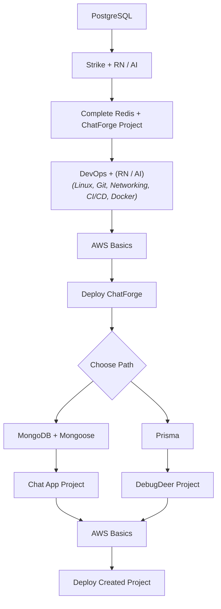

# Backend Developer Learning Roadmap

## 1. PostgreSQL

Complete the PostgreSQL course:
https://youtu.be/oQRmL4ry5qw

Learn:

- SQL
- Relationships
- Joins
- Indexes
- Transactions
- Constraints
- Database design

## 2. Prisma

Learn Prisma:
https://youtu.be/Jc88X6McHOc

## 3. Testing

Learn:
https://youtu.be/_SDR6vAGens

- Vitest
- Supertest

## 4. E-Commerce Project

Start the E-Commerce project:
https://youtu.be/Byw6eSQ7Ff0

- Change MongoDB → PostgreSQL
- Change Clerk → Custom Authentication
- Integrate Prisma
- Complete the project
- Test the APIs

## 5. Redis

Learn:
https://youtu.be/hFNnNVawHhk

- Caching
- TTL
- Cache invalidation
- Rate limiting

## 6. Implement Redis in E-Commerce

Add:

- Product caching
- Category caching
- Rate limiting
- Cache invalidation

## 7. Docker

Learn:
https://youtu.be/-FHyCgiaxkc

- Dockerfile
- Images
- Containers
- Docker Compose
- Environment variables

## 8. Linux Basics

Thunder course.

Learn:

- Basic commands
- Filesystem
- Processes
- Ports
- Permissions
- SSH
- Basic networking

## 9. Dockerize E-Commerce

- Dockerize backend
- PostgreSQL container
- Redis container
- Docker Compose
- Environment configuration

## 10. AWS Basics + CI/CD

Learn AWS basics and CI/CD:
https://youtu.be/lweDf3_q-sk?t=16353

AWS:

- EC2
- RDS
- S3
- IAM basics
- CloudWatch basics

CI/CD:

- GitHub Actions
- Build
- Test
- Deploy

## 11. Deploy E-Commerce

Deploy the complete E-Commerce project to AWS.

- Backend
- Database
- Redis
- Frontend
- Environment variables
- HTTPS/domain
- CI/CD

## 12. MongoDB + Mongoose

Learn:

- MongoDB basics
- CRUD
- Aggregation basics
- Indexes
- Data modeling
- Mongoose

## 13. WebSockets

Learn:
https://youtu.be/UUddpbgPEJM
https://youtu.be/Xn_j5sE6M_k

## 14. Chat Application

Build:
https://youtu.be/ufo46oWej3g

Then add:

- Group chat
- Read receipts
- File sharing
- Notifications

may be needed just optional(https://youtu.be/FhUekn5lUTw)

Optional:

- Redis
- Docker

## 15. Deploy Chat Application

- Dockerize
- Deploy to AWS
- Configure WebSockets
- # Add CI/CD

## extra

https://youtu.be/1NI0qLGio1w
https://youtu.be/5fQOQcReSA8

---

---

# GEN AI Learning Roadmap

1. Complete the 100 Days of AI Engineering
   https://youtube.com/playlist?list=PLNCBQC4JDkD1qVm8lDWY_JG2CKp2BP7Pz&si=w8s3HLJZPmm1Qm_X

2. Then complete this course
   https://www.udemy.com/course/production-ai-agents-with-javascript-langchain-langgraph/?couponCode=CP260817G1

\*\*\* Nothing else.
